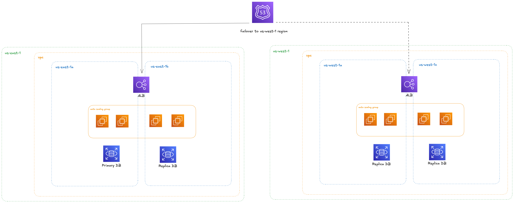

# HA WordPress Infrastructure

This project provisions a highly available (HA) WordPress deployment using Terraform and Ansible. It is designed for AWS, but can be adapted to other cloud providers.

## High-Level Design



## Design Overview

- **Terraform** is used for infrastructure provisioning:
  - **Networking**: VPC, subnets, security groups
  - **Compute**: Auto Scaling Group (ASG) for web servers, ALB for load balancing
  - **Database**: RDS (or similar) for managed MySQL
  - **IAM**: Roles and policies for least-privilege access
  - **S3 Buckets**: For static assets, logs, and backups
- **Ansible** is used for configuration management:
  - Installs Apache, PHP, and WordPress on EC2 instances
  - Configures WordPress with environment-specific settings
  - Handles service restarts and package management

## Directory Structure

- `terraform/` — Infrastructure as Code (IaC) for AWS resources
  - `main.tf`, `variables.tf`, etc.: Root configuration
  - `modules/`: Reusable Terraform modules (networking, database, webservers, etc.)
  - `_tfvars/`: Environment-specific variable files
- `ansible/` — Playbooks and roles for server configuration
  - `wordpress-install.yml`: Main playbook
  - `roles/wordpress/`: Role for WordPress setup (tasks, templates, handlers, etc.)

## Deployment Steps

### 1. Infrastructure Provisioning (Terraform)

1. **Initialize Terraform**

```sh
cd terraform
terraform init
```

2. **Select Environment Variables**

   - Edit or use the appropriate tfvars file in `_tfvars/` (e.g., `prod.tfvars`)

3. **Plan and Apply**

```sh
terraform plan -var-file="_tfvars/prod.tfvars"
terraform apply -var-file="_tfvars/prod.tfvars"
```

4. **Output**
   - Note the outputs (e.g., public IPs, ALB DNS, RDS endpoint)

### 2. Configuration Management (Ansible)

1. **Update Inventory**
   - Edit `ansible/inventory` with the public/private IPs of the provisioned EC2 instances
2. **Configure Ansible Variables**
   - Edit `roles/wordpress/vars/main.yml` and `defaults/main.yml` as needed
3. **Run Playbook**

```sh
cd ansible
ansible-playbook -i inventory wordpress-install.yml
```

## Assumptions

- AWS credentials are configured and have sufficient permissions
- SSH access to EC2 instances is available (key pair configured)
- RDS or database endpoint is accessible from web servers
- DNS and SSL are managed outside this repo (can be added as needed)
- The project is modular and can be extended for staging/production via tfvars

## Notes

- For production, ensure secrets (DB password, etc.) are managed securely (e.g., AWS Secrets Manager)
- Backups and monitoring are recommended for RDS and EC2
- The Ansible playbook is idempotent and can be re-run safely

---

For questions or improvements, please open an issue or PR.
